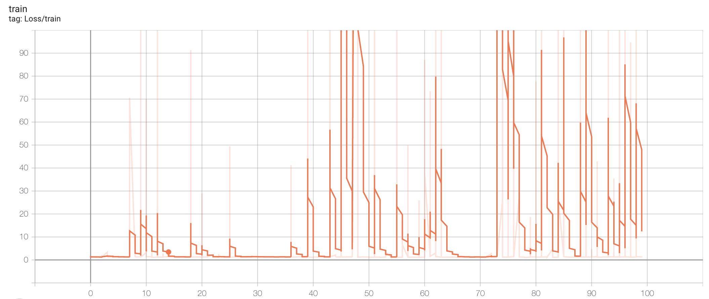
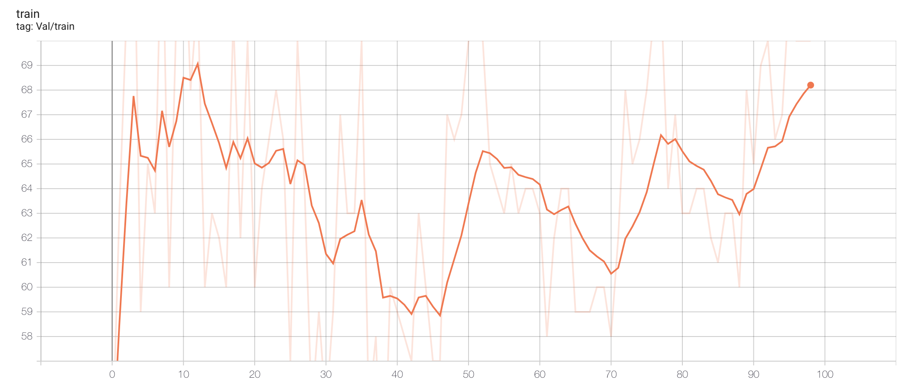
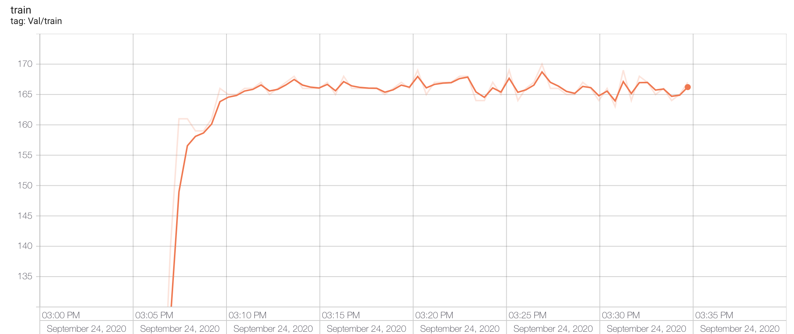

# READ ME
本次实验开始时间：2020-9-21，对现有的4种菌物：伞菌， 牛肝菌，盘菌，地衣，用已有的方法进行分类实验，调查普通深度学习方法在菌物分类领域中的效果，并寻找可以改进的地方。

# 数据预处理
本次实验根据暑假进行的第一次实验过程对数据预处理部分进行了改进，原有的数据情况如下：

|       | agaric | bolete | discomycete | lichen |
| :---: | :----: | :----: | :---------: | :----: |
| train |  1322  |  1327  |     852     |  1974  |
|  val  |  200   |  200   |     200     |  200   |

暑假进行的实验中对数据的预处理是将所有图片的训练集调整至2000张左右，测试集不变，由于服务器突然断电，所以训练没有完成。但是通过训练过程发现，显卡占用率很低，且训练速度慢，所以本次实验计划用较少的样本进行训练，观察效果。经过数据预处理后，数据情况如下：

|       | Agaric | Bolete | Discomycete | Lichen |
| :---: | :----: | :----: | :---------: | :----: |
| Train |  507   |  506   |     481     |  499   |
|  Val  |   48   |   44   |     52      |   38   |

# 训练过程

## 模型
本次实验采用VGG19模型，并从官网加载了预训练模型，将最后的全连阶层的输出神经元个数改为4，其他均未调整。

## 训练过程
训练的各项超参数如下：

|      | 学习率 | 正则化系数 | batch_size | 训练轮数 | num_workers |
| :--: | :----: | :--------: | :--------: | :------: | :---------: |
| 数据 |  3e-4  |    1e-3    |     32     |   100    |     32      |

训练中对每一轮都进行测试，将当前测试结果最好的模型参数进行保存。训练过程中，遇到如下问题：

- 训练速度慢，每次都需要13分钟，预测需要3分钟。初步判断是数据读写速度太慢，导致gpu总是等待cpu传输数据导致的，后通过将数据直接加载到gpu上解决，目前一轮训练耗时约25s，预测耗时3.5s。

- 训练过程中eval准确率低，每轮训练过后eval的准确率只有0.01左右，明显存在问题。后发现是预测过程的结果输出有问题，训练过程一切正常。

- 训练过程中eval准确率一直上不去，在40%徘徊，训练中的loss和预测曲线如下(预测曲线中，纵轴代表预测正确的总数，测试集总照片数为182)：

  

  

## 调整过程
- 首先用保存的模型参数对训练集进行测试，共进行三次测试，准确率都在0.43左右，说明模型欠拟合。

- 首先去掉加载预训练模型部分，并使用官方模型中自带的初始化参数方法对模型进行初始化，预测准确率最后稳定在0.24左右，说明加载预训练模型对模型训练是有帮助的。

- 训练中使用的优化器是Adam优化器，尝试降低正则化权重，效果不明显，说明并不是正则化影响了拟合能力。

- 发现是每个batch没有进行梯度清零，造成梯度堆积所以预测准确率一直无法得到提高。经过梯度清零后，预测准确率稳定在80%左右。

- 将测试用图像经过归一化及resize处理后，预测准确度提升至85%左右。

- 将优化器从Adam换成SGD，最高精度提升至91.2%，原因未知。

# 训练结果
- 最终训练使用的各个超参数如下：

|      | 学习率 | momentum | Batch_size | 优化器 |
| :--: | :----: | :------: | :--------: | :----: |
| 数据 |  3e-4  |   0.9    |     32     |  SGD   |

- 在测试集的识别准确率稳定在91.2%左右，最高准确率92.3%：

  

