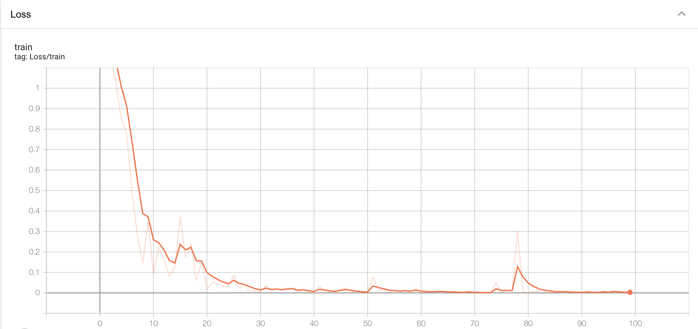
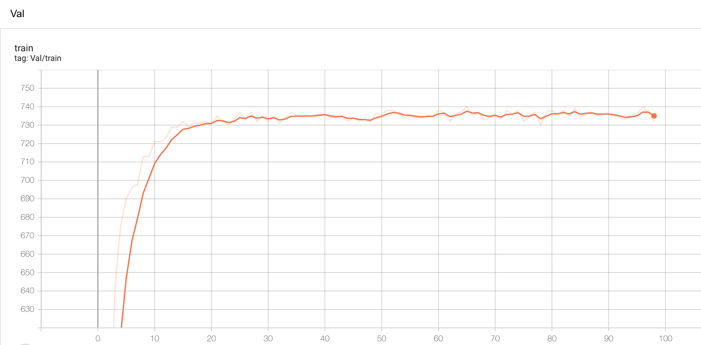

# 实验概况
本次实验主要从三个方面入手：

- 调整训练集和测试集比例进行测试
- 对单独类别的测试
- 用图像分类的主流模型进行分别进行训练和测试

# 调整训练集和测试集比例
- 第一次实验数据集比例：

|       | agaric | bolete | discomycete | lichen |
| :---: | :----: | :----: | :---------: | :----: |
| train |  2030  |  2001  |    1704     |  1974  |
|  val  |  200   |  200   |     200     |  200   |

- 本次实验保留每个类别的测试集，对训练集进行调整，将训练集与测试集的比例调整为7:3，即将每个类别的训练集图片数量调整至467张左右，同时训练集中的图片都为原图进行随机翻转得来。数据情况如下：

|       | Agaric | Bolete | Discomycete | Lichen |
| :---: | :----: | :----: | :---------: | :----: |
| train |  465   |  447   |     473     |  485   |
|  val  |  200   |  200   |     200     |  200   |

- 训练情况如下，第一张图为loss，第二张图为正确率， 最终测试结果为92.1%：

  

# 分类测试
- 对四个类别进行分类测试，分别用小预测集和完整预测集进行分类测试，模型参数是分别在小训练集和完成训练集上训练的。其中用小数据集进行预测时发现agaric，discomycete和lichen准确率较高，都在92%以上。用大数据集进行预测时agaric， bolete和lichen的预测准确率较高，而discomycete准确率较低，预测结果如下所示：

|                    | agaric | bolete | discomycete | lichen |
| :----------------: | :----: | :----: | :---------: | :----: |
|  小训练集（467）   |  93%   | 86.5%  |    92.5%    | 96.5%  |
| 完成训练集（2000） |  95%   |  92%   |    89.5%    | 99.5%  |

# 不同模型测试
- 选取mobileNet_V2，InceptionV3， ResNet50分别在467数据集和2000数据集上进行训练和分类测试。

## MobileNet_V2
mobiletNet_V2的主要特点是将部分卷基层换成了深度可分离卷积，并将激活函数从MobileNet_V1的Relu6换成了线性激活函数。测试结果：

|                    | agaric | bolete | discomycete | lichen | total  |
| :----------------: | :----: | :----: | :---------: | :----: | :----: |
|  小训练集（467）   | 95.5%  |  92%   |     92%     |  96%   | 93.87% |
| 完整训练集（2000） |  98%   |  93%   |    91.5%    |  98%   | 95.12% |

